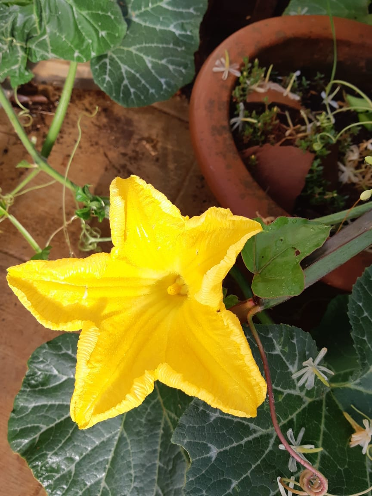
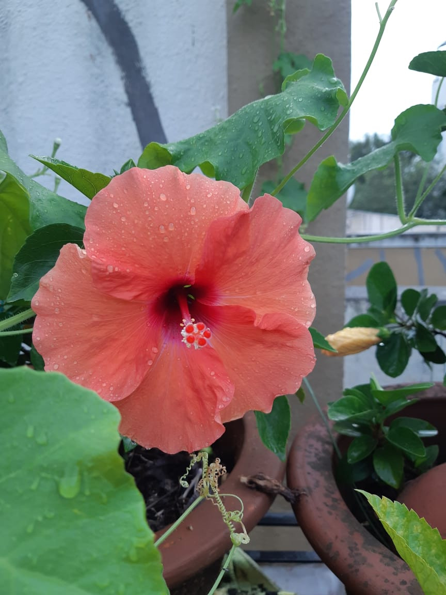
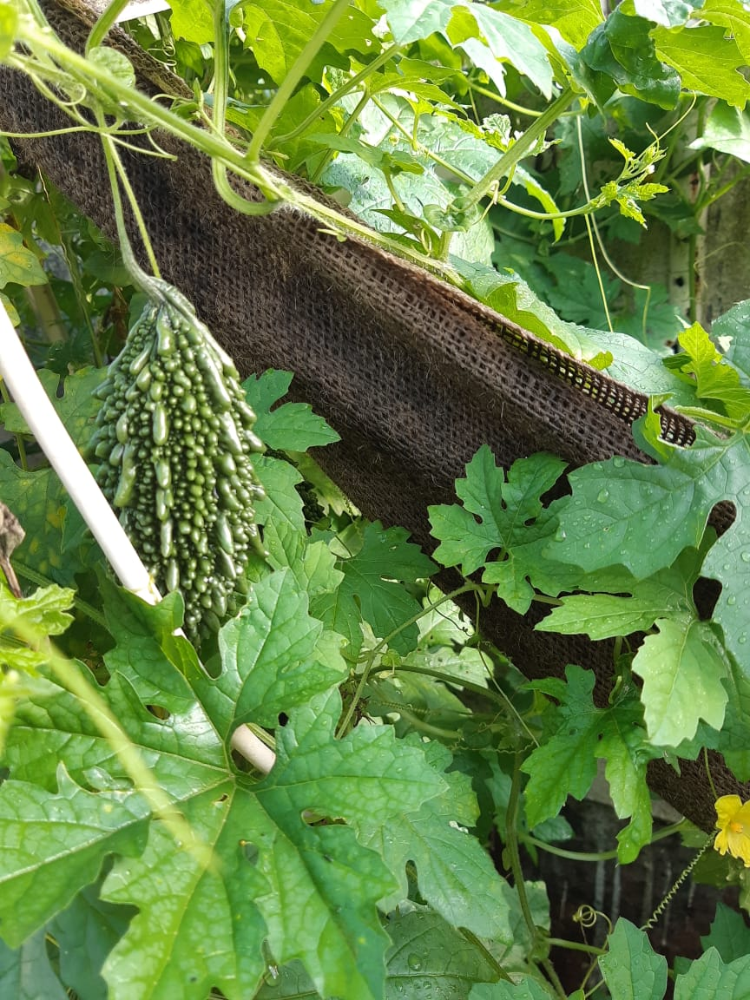

# Babita Kitchen Garden Mumbai, India

Babita ji is one gentle down to earth lady, with a mission to make world a better place through her unnoticed humble actions. She has dedicated her life to plants and farming activities with her family. To inspire future generations, she has been active in innovative ways in education and memorization techniques for children. She has divine sense of cooking and is gifted in that area! She takes pride in her flowers and loves to mother her cats. 

Based at Mumbai, India and her [community farm Jeevan Aranya](https://nehalsin.github.io/jeevan-aranya-belvandi/) at Belvandi (130 KM from Mumbai), some of her inspiring garden pics can be seen here.

### 2021-09-07

### 2021-06-19

Image Source: Babita ji
